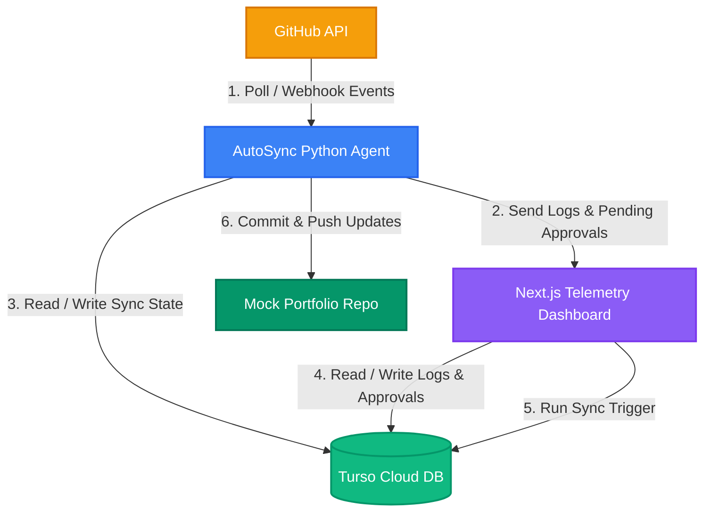

# 🚀 Developer Portfolio AutoSync Agent

<p align="center">
  
  
  
  
  
</p>

An automated, modular agent that polls or receives webhooks for new GitHub repositories, extracts their metadata, uses LLMs to generate professional project descriptions, and automatically syncs them into your developer portfolio—complete with a real-time Next.js telemetry and approval dashboard.

---

## 🛠️ Features

* **Auto-Discovery**: Polls GitHub repositories or listens to webhooks to identify new project additions in real-time.
* **LLM-Powered Descriptions**: Utilizes OpenAI (GPT-4o) or Claude to extract technologies and generate clean, engaging summaries of projects.
* **Telemetrics Dashboard**: A modern Next.js dashboard featuring live logs, success rates, and sync statistics.
* **Interactive Approval Flow**: Visual diff approvals on the dashboard allow you to approve, customize, or reject updates before they are committed to production.
* **Instant Sync Trigger**: Trigger a synchronization cycle on-demand via the **"Run Sync Now"** dashboard button.
* **Persistent Turso Integration**: Fully backed by Turso libSQL to provide seamless, shared cloud-database state between the local agent and the deployed dashboard.
* **Docker Support**: Containerized configuration for simple, one-step deployment of the agent and dashboard.

---

## 📐 Architecture

Below is the live system flow diagram rendered directly in the Markdown viewer:



### 🔍 Component Details

<details>
  <summary>🌐 <b>GitHub API</b> (Click to expand)</summary>
  <br>
  <ul>
    <li><b>System Role:</b> Data source for discoverable project repositories.</li>
    <li><b>Trigger Frequency:</b> Polling cycles or incoming webhooks.</li>
    <li><b>Configuration:</b> <code>GITHUB_TOKEN</code> with <code>repo</code> scopes.</li>
    <li><b>Key Files:</b> <a href="src/github_client.py">src/github_client.py</a></li>
    <li><b>Technologies:</b> REST API, JSON, GraphQL, Personal Access Tokens</li>
  </ul>
</details>

<details>
  <summary>🐍 <b>AutoSync Python Agent</b> (Click to expand)</summary>
  <br>
  <ul>
    <li><b>System Role:</b> Local polling orchestrator, OpenAI parser, and Git automation engine.</li>
    <li><b>Trigger Frequency:</b> Daemon mode checking sync state flags every 10 seconds or on a set cron interval.</li>
    <li><b>Configuration:</b> <code>config.yaml</code> and <code>.env</code></li>
    <li><b>Key Files:</b> <a href="main.py">main.py</a>, <a href="src/portfolio_manager.py">src/portfolio_manager.py</a>, <a href="src/llm_router.py">src/llm_router.py</a></li>
    <li><b>Technologies:</b> Python 3.9, FastAPI, Uvicorn, GitPython, OpenAI SDK</li>
  </ul>
</details>

<details>
  <summary>💻 <b>Vercel Telemetry Dashboard</b> (Click to expand)</summary>
  <br>
  <ul>
    <li><b>System Role:</b> Dashboard UI for execution telemetry logs, stats, and green/red unified approval diffs.</li>
    <li><b>Trigger Frequency:</b> Allows manual "Run Sync Now" action that posts pending trigger states directly to Turso.</li>
    <li><b>Configuration:</b> Next.js Serverless APIs</li>
    <li><b>Key Files:</b> <code>dashboard/src/app/api/approvals</code>, <code>dashboard/src/app/api/logs</code>, <code>dashboard/src/app/api/sync-request</code></li>
    <li><b>Technologies:</b> Next.js 15, React 19, CSS Grid, Serverless API Routes</li>
  </ul>
</details>

<details>
  <summary>🗄️ <b>Turso DB (libSQL)</b> (Click to expand)</summary>
  <br>
  <ul>
    <li><b>System Role:</b> Cloud database containing shared sync state, audit logs, and approval queues.</li>
    <li><b>Trigger Frequency:</b> Automatically triggers schema validation/creation on dashboard initialization.</li>
    <li><b>Configuration:</b> <code>TURSO_DATABASE_URL</code> and <code>TURSO_AUTH_TOKEN</code></li>
    <li><b>Key Files:</b> <a href="dashboard/src/app/api/db.js">dashboard/src/app/api/db.js</a></li>
    <li><b>Technologies:</b> libSQL client, SQLite3, Cloud Databases, Auto-Migrations</li>
  </ul>
</details>

<details>
  <summary>📂 <b>Mock Developer Portfolio</b> (Click to expand)</summary>
  <br>
  <ul>
    <li><b>System Role:</b> Target git repository destination.</li>
    <li><b>Trigger Frequency:</b> Synchronized when local agent receives approval status from database.</li>
    <li><b>Configuration:</b> <code>config.yaml</code> (under <code>portfolio</code> section)</li>
    <li><b>Key Files:</b> <code>mock_portfolio/projects.json</code></li>
    <li><b>Technologies:</b> Git Branch (det/prod), JSON, Markdown, Git Commits</li>
  </ul>
</details>

<br>

> 💡 **Tip:** You can also open the **[Interactive Architecture Diagram](architecture.html)** locally in your browser to inspect this setup in an animated graphical format.

---

## 🚀 Getting Started

### 1. Prerequisites
- **Python 3.9+** and **Node.js 20+**
- A **GitHub Personal Access Token** (with `repo` permissions)
- A **Turso/libSQL database** and Auth Token
- An **OpenAI API Key** (for metadata generation)

### 2. Installation
Clone the repository and install the dependencies:

```bash
# Install Python virtual environment and packages
python3 -m venv .venv
source .venv/bin/activate
pip install -r requirements.txt

# Install Dashboard dependencies
cd dashboard
npm install
```

### 3. Configuration
Configure the agent and dashboard by editing the environment variables.

Create a [`.env`](file:///Users/saransh/vs%20code/Developer%20Portfolio%20AutoSync%20Agent/.env) file in the root directory:
```env
# GitHub Credentials
GITHUB_TOKEN=your-github-token

# LLM Credentials
OPENAI_API_KEY=your-openai-api-key

# Telemetry Dashboard URL
VERCEL_DASHBOARD_URL=https://developer-portfolio-auto-sync-agent.vercel.app

# Turso Cloud Database
TURSO_DATABASE_URL=libsql://your-db-route.turso.io
TURSO_AUTH_TOKEN=your-auth-token
```

Create a [`config.yaml`](file:///Users/saransh/vs%20code/Developer%20Portfolio%20AutoSync%20Agent/config.yaml) file:
```yaml
github:
  username: "your-github-username"
  poll_interval: 3600

portfolio:
  local_path: "./mock_portfolio"
  repo_url: "https://github.com/your-username/portfolio.git"
  branch: "det"
  structure_type: "json"
  file_path: "projects.json"

llm:
  provider: "openai"
  openai_model: "gpt-4o"
```

---

## 🏃 Running the Application

### Method A: Docker Compose (Recommended)
Launch the entire stack (telemetry server and dashboard) with a single command:
```bash
docker-compose up --build
```

### Method B: Manual Execution
1. **Start the Next.js Dashboard**:
   ```bash
   cd dashboard
   npm run dev
   ```
   *The dashboard will start on `http://localhost:3000`.*

2. **Start the Python Agent**:
   In another terminal tab, launch the agent in FastAPI webhook/serve mode:
   ```bash
   source .venv/bin/activate
   python3 main.py --serve
   ```
   *This starts the webhook receiver on port `8000` and automatically runs the daemon loop in the background, checking for dashboard sync requests every 10 seconds.*

---

## 📊 Dashboard Telemetry

The Next.js panel allows you to monitor and control the synchronization agent:
- **Execution Stream**: Real-time logging of repository discovery, LLM requests, and git merges.
- **Pending Review Queue**: Displays proposed changes (with visual green/red unified diffs).
- **Run Sync Now**: Instantly wakes up the local agent daemon to scan for updates on-demand.
